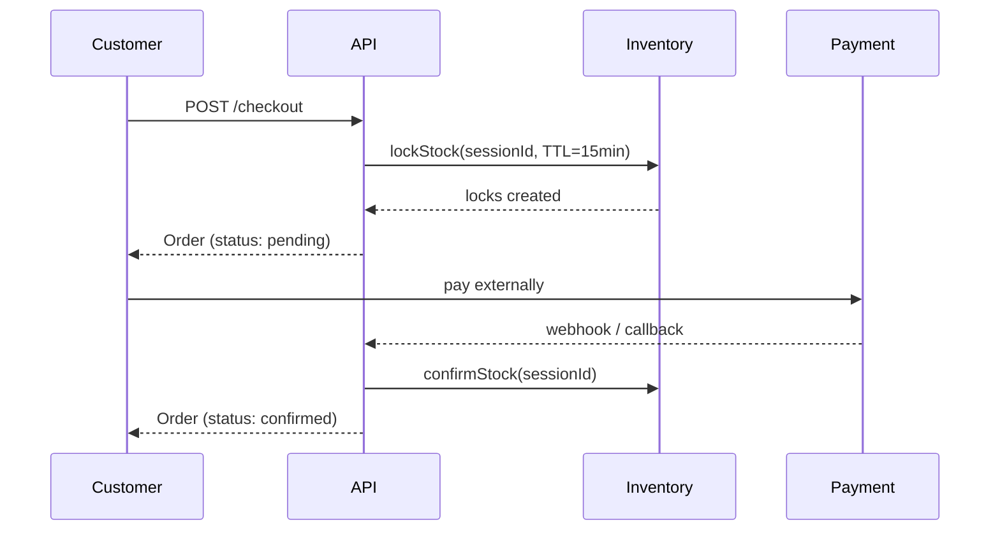

# Key Logic & Edge Case Handling

A deep-dive into the critical business logic, data-integrity guards, and edge-case handling built into this ERP backend.

---

## 1. Inventory – Transactional Safety

### 1.1 Negative-Stock Prevention (`adjustStock`)

Manual stock adjustments use an **optimistic apply-then-verify** pattern. The quantity is incremented first, then checked – if the result is negative the change is immediately rolled back.

```js
// inventory.service.js
const inv = await Inventory.findOneAndUpdate(
  { businessId, productId, storeId },
  { $inc: { quantity: quantityChange } },
  { new: true, upsert: true },
);
if (inv.quantity < 0) {
  // rollback
  await Inventory.findOneAndUpdate(..., { $inc: { quantity: -quantityChange } });
  throw new Error('Adjustment would result in negative stock');
}
```

> [!IMPORTANT]
> The `upsert: true` flag ensures first-ever adjustments create the record automatically instead of failing with "not found".

### 1.2 Atomic Inter-Store Transfers (`transferStock`)

Transfers wrap all operations in a **Mongoose session / transaction** so either every store is updated or none are.

| Step                  | Guard                                                                                               |
| --------------------- | --------------------------------------------------------------------------------------------------- |
| Decrement source      | `quantity: { $gte: item.quantity }` filter – if insufficient, the `findOneAndUpdate` returns `null` |
| Increment destination | `upsert: true` – creates inventory row if the destination store never held this product             |
| Abort on failure      | `session.abortTransaction()` in `catch` + `session.endSession()` in `finally`                       |

### 1.3 Stock Locking for Ecommerce (`lockStock`)

Checkout soft-reserves stock so other buyers can't oversell it.

```
lockStock()  →  check (quantity - reservedQuantity >= requested)
              →  $inc reservedQuantity
              →  create StockLock with TTL

confirmStock()  →  $inc { quantity: -qty, reservedQuantity: -qty }
                →  mark lock "confirmed"

releaseStock()  →  $inc { reservedQuantity: -qty }
                →  mark lock "released"
```

**Edge cases handled:**

| Scenario                      | Handling                                                                                         |
| ----------------------------- | ------------------------------------------------------------------------------------------------ |
| Lock expires before payment   | MongoDB TTL index (`expireAfterSeconds: 0` on `expiresAt`) auto-deletes the `StockLock` document |
| Concurrent checkout race      | Transaction + `$gte` check on available quantity – second buyer gets a clear `400` error         |
| Partial lock failure mid-loop | Entire transaction aborts – no items are partially reserved                                      |

---

## 2. POS – Order Creation & Refunds

### 2.1 Channel Visibility (`createOrder`)

Products have a `visibility` field (`pos_only`, `ecommerce_only`, or `both`). POS rejects ecommerce-only products, and vice versa:

```js
// pos.service.js
if (product.visibility === 'ecommerce_only')
	throw new Error(`Product ${product.sku} is ecommerce-only`);

// ecommerce.service.js
if (product.visibility === 'pos_only')
	throw new Error(`Product ${product.sku} is POS-only`);
```

### 2.2 Cross-Business Product Guard

Every product lookup validates that `product.businessId` matches the request's business context, preventing a crafted `productId` from leaking data across tenants:

```js
if (!product || String(product.businessId) !== String(businessId))
	throw Object.assign(new Error(`Product not found`), { status: 404 });
```

### 2.3 Credit Sale Enforcement

Credit sales require a `customerId` and check the customer's available credit (`creditLimit - currentBalance`). The order is created inside a transaction, and only after success is the credit ledger entry written.

```
credit sale │  customerId required?   → 400 if missing
            │  availableCredit < amount → 400 "Credit limit exceeded"
            │  success                 → atomically update currentBalance + create CreditAccount entry
```

### 2.4 Refund – Partial Item Return

The refund flow validates each returned item exists in the original order. Stock is restored and, for credit orders, the customer's AR balance is automatically reduced:

```
refund │  item not in original order?  → 400
       │  restock inventory            → $inc quantity (upsert)
       │  credit order?               → recordCustomerReturn (reduces AR)
       │  mark order "returned"
```

---

## 3. Ecommerce – Checkout Flow

### 3.1 Two-Phase Commit

Ecommerce uses a **two-phase checkout** to bridge the gap between the user clicking "Place Order" and completing payment:



### 3.2 Fulfillment Store Assignment

After confirmation, an admin assigns a physical store to fulfill the ecommerce order:

```js
assignStore(orderId, storeId);
// → status transitions to "processing"
```

### 3.3 Return at Different Store

Ecommerce returns can be processed at **any store**, not just the fulfillment store. The `storeId` in the return payload determines where the stock is restocked, allowing flexible walk-in returns.

---

## 4. Credit Management – AR & AP

### 4.1 Balance Floor (`Math.max(0, ...)`)

Payments and returns use `Math.max(0, currentBalance - amount)` to prevent a balance from going negative, which could happen if an overpayment or double-return is processed:

```js
customer.currentBalance = Math.max(0, customer.currentBalance - amount);
```

This pattern is applied consistently to:

- Customer payments (`recordCustomerPayment`)
- Customer returns (`recordCustomerReturn`)
- Supplier payments (`recordSupplierPayment`)
- Supplier returns (`recordSupplierReturn`)

### 4.2 Ledger as Audit Trail

Every credit operation creates a `CreditAccount` entry with a running `balance` snapshot, signed `amount` (positive for debits, negative for credits), and `orderId` / `purchaseOrderId` reference. Entries are queried in reverse-chronological order for the ledger API.

---

## 5. Purchase Order Lifecycle

### 5.1 State Machine

```
draft → approved → sent → partial_received → closed
                                  ↘ cancelled
```

### 5.2 Over-Receive Guard

When receiving a delivery, each item's `receivedQty + incoming` is checked against `orderedQty`:

```js
if (poItem.receivedQty + recv.quantity > poItem.orderedQty)
	throw new Error(`Received qty exceeds ordered qty for ${poItem.sku}`);
```

### 5.3 Auto-Close Detection

After processing received items, the service checks if **all** items have been fully received and auto-transitions the PO to `closed`:

```js
const allReceived = po.items.every((i) => i.receivedQty >= i.orderedQty);
po.status = allReceived ? 'closed' : 'partial_received';
```

### 5.4 Supplier Invoice Price Validation

When creating a `SupplierInvoice`, every line item's `unitPrice` is cross-checked against the linked PO. If any price differs, the invoice is rejected with a descriptive error:

```
PO unitPrice=50  vs  Invoice unitPrice=55  →  400 "Price mismatch for SKU-001"
```

---

## 6. Multi-Tenant Security

### 6.1 RBAC Middleware

The auth middleware is a **closure factory** – each route specifies its allowed roles:

```js
router.post('/', auth(['business_admin', 'store_manager']), controller.create);
```

Role hierarchy: `super_admin` > `business_admin` > `store_manager` > `inventory_manager` > `accountant` > `cashier`

### 6.2 Cross-Business Isolation

Non-super-admin users are checked against the requested `businessId` (from URL params or `x-business-id` header). Mismatches return `403 Cross-business access denied`.

### 6.3 Business Context Middleware

The `businessContext` middleware runs on all business-scoped routes. It:

1. Requires a `businessId` (400 if missing)
2. Validates the business exists (404 if not)
3. Checks the business is active (403 if deactivated)

> [!WARNING]
> Deactivated businesses are fully locked out at the middleware level – no data operations are possible until reactivated.

---

## 7. Audit Logging

### Fire-and-Forget Pattern

Audit logging is **non-blocking**: failures are caught and logged to `console.error` but never propagate to the caller. This ensures a logging infrastructure failure can't break business transactions.

```js
async function logAudit({ businessId, userId, action, entity, entityId, changes }) {
  try {
    await AuditLog.create({ ... });
  } catch (err) {
    console.error('Audit log failed:', err.message);  // swallowed
  }
}
```

Audited actions include: stock adjustments, transfers, POS sales, refunds, ecommerce confirmations, returns, PO receives, and credit operations.

---

## 8. Error Handling Strategy

### 8.1 Structured Error Objects

All service-layer errors attach an HTTP `status` code via `Object.assign`:

```js
throw Object.assign(new Error('Credit limit exceeded'), { status: 400 });
```

### 8.2 Central Error Handler

The `errorHandler` middleware maps these to proper HTTP responses:

| Error Type                  | Status                  |
| --------------------------- | ----------------------- |
| Mongoose `ValidationError`  | `400`                   |
| Custom error with `.status` | Whatever `.status` says |
| Uncaught / unknown          | `500`                   |

### 8.3 Transaction Cleanup

Every transactional function follows the same `try / catch / finally` pattern:

```js
try {
	// ... business logic inside session ...
	await session.commitTransaction();
} catch (err) {
	await session.abortTransaction();
	throw err;
} finally {
	session.endSession(); // always clean up
}
```

---

## 9. Reporting – Query Edge Cases

### 9.1 Cancelled/Returned Order Exclusion

All sales reports filter out `cancelled` and `returned` orders to avoid inflating revenue figures:

```js
status: {
	$nin: ['cancelled', 'returned'];
}
```

### 9.2 Low Stock – Available vs Physical

The low-stock alert uses `$expr` to compute `quantity - reservedQuantity` directly in the query, giving the **true available** count rather than the physical count:

```js
$expr: {
	$lte: [{ $subtract: ['$quantity', '$reservedQuantity'] }, threshold];
}
```

### 9.3 Profit Margin – Division-by-Zero Guard

The `profitPerSku` aggregation uses `$cond` to return `0` margin when revenue is zero, preventing a MongoDB division error:

```js
$cond: [{ $eq: ['$totalRevenue', 0] }, 0 /* margin calculation */];
```

---

## 10. Pagination Pattern

List endpoints (purchase orders, supplier invoices) implement a consistent pagination pattern:

```js
const skip = (page - 1) * limit;
const [items, total] = await Promise.all([
	Model.find(query).skip(skip).limit(limit),
	Model.countDocuments(query),
]);
return { items, total, page, limit };
```

This returns both the data slice and total count in a single response, enabling the frontend to render pagination controls without a separate API call.
